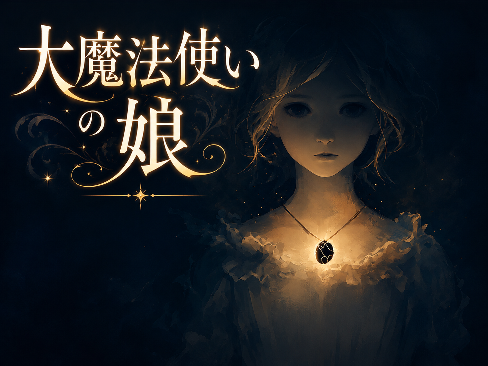

<!-- THUMBNAIL -->

<!-- /THUMBNAIL -->

# 大魔法使いの娘

**GitHub連載・実験小説**

▶ **[Webで読む（読書サイト）](https://kzhrknt.github.io/ai-serial-novel/)**

環境・システムを人間がつくって、コンテンツをAIがつくる——
今後主流になるであろうクリエイティブ開発プロセスを、ラノベをテーマにやってみます。

果たしておもしろくなるのかは、僕にもわかりません。
生成されたエピソードに、人間の手は加えません。実験です。

- 配信：週三回（月・水・金）。生成されしだい、このリポジトリに自動で追加されます。
- 1話あたり約5,000〜6,000字。
- 物語の設定・プロット・生成システムは別管理（このリポジトリにはエピソード本文だけを置きます）。

---

## 目次

<!-- EPISODES:START -->
- [第1話　首飾りが外れた日](episodes/ep001.md)
- [第2話　三日のうちに](episodes/ep002.md)
- [第3話　忘れられた書庫](episodes/ep003.md)
- [第4話　夜の馬車](episodes/ep004.md)
- [第5話　名前を呼ぶ練習](episodes/ep005.md)
- [第6話　外れた力](episodes/ep006.md)
- [第7話　王都の門](episodes/ep007.md)
- [第8話　大司教セラフィナ](episodes/ep008.md)
- [第9話　名喰いの影](episodes/ep009.md)
- [第10話　鐘楼の夜](episodes/ep010.md)
- [第11話　あるべき場所](episodes/ep011.md)
- [第12話　呼べない名前](episodes/ep012.md)
- [第13話　隠れられない](episodes/ep013.md)
- [第14話　読める人](episodes/ep014.md)
- [第15話　外れる](episodes/ep015.md)
- [第16話　つけたまま](episodes/ep016.md)
- [第17話　薄明](episodes/ep017.md)
- [第18話　たしかめる](episodes/ep018.md)
- [第19話　呼んでも、奪われる](episodes/ep019.md)
- [第20話　自分の足で、昇る](episodes/ep020.md)
- [第21話　逃げてきたんじゃない](episodes/ep021.md)
- [第22話　落ちる場所で待つ](episodes/ep022.md)
- [第23話　弱い火を、散らす](episodes/ep023.md)
- [第24話　広がって、戻る](episodes/ep024.md)
- [第25話　火を、囲んでいた](episodes/ep025.md)
<!-- EPISODES:END -->

---

> 生成：Claude（Anthropic）／システム設計・運用：人間
> この作品はAIによる連載実験です。
